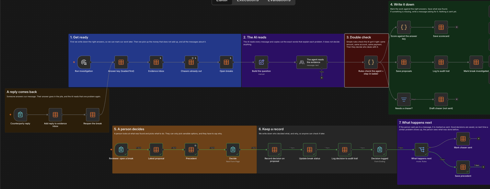
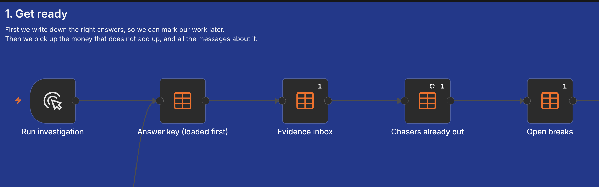
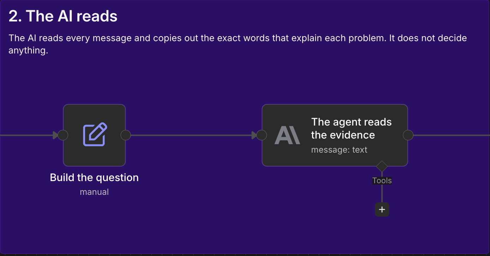
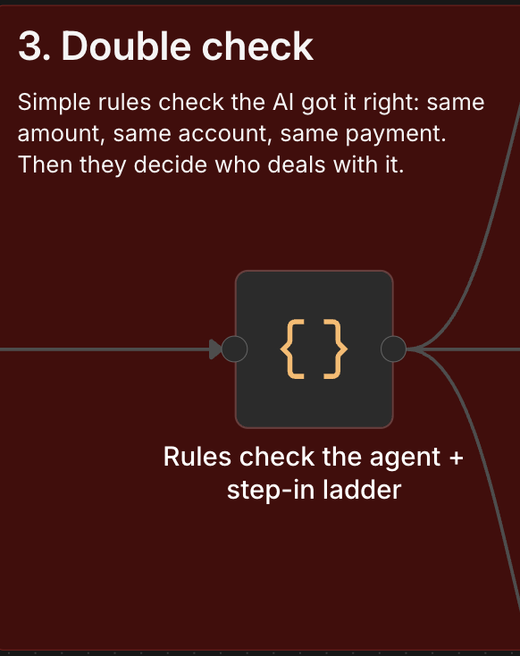
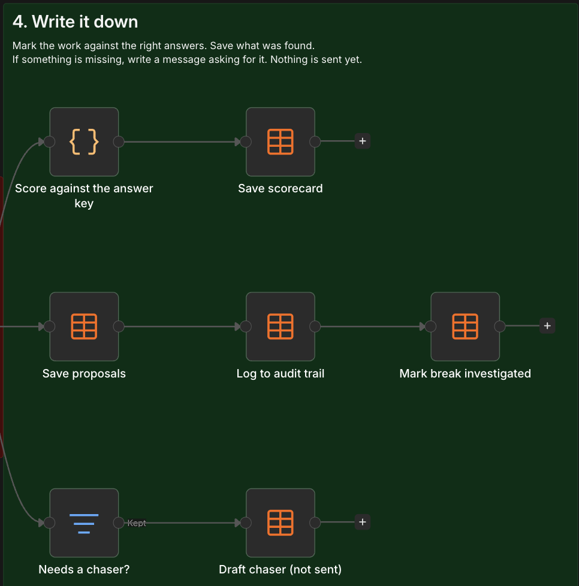
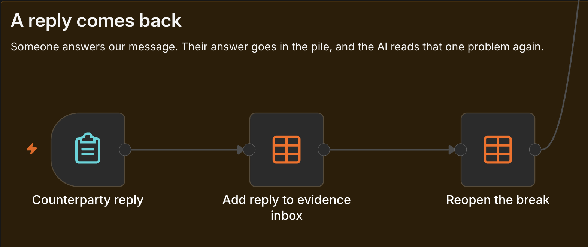
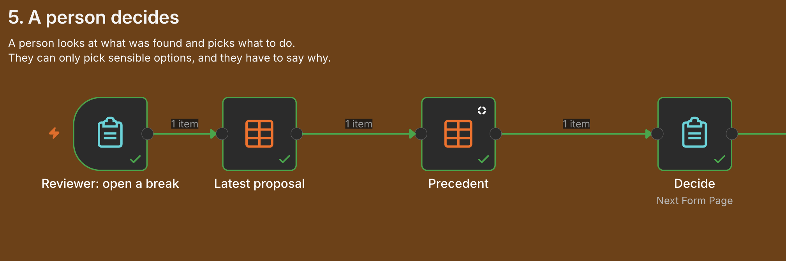
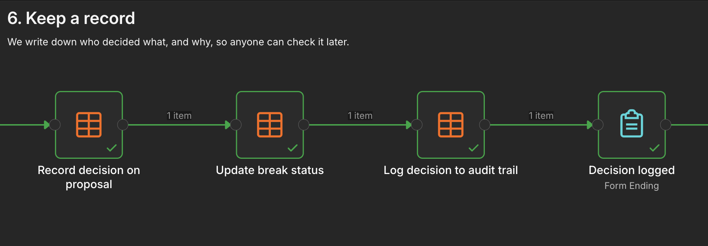
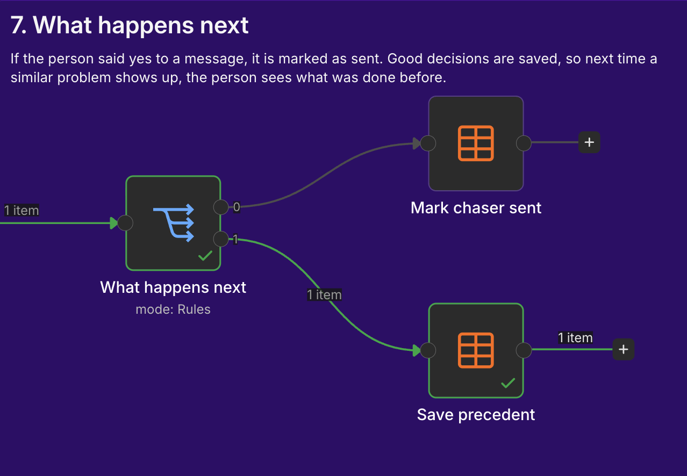

# Cash Break Investigation

When a fund's cash does not match the bank, someone has to work out why: search the emails and bank notices, check the right payment, and chase the bank or counterparty when nothing explains it. Built to send to Karl in relation to Addetto. 

This is a small, working version of that loop, built in n8n. An AI reads the messages behind each break and quotes the line that explains it. Rules check that quote against the message itself. Where nothing explains the break, a chaser is drafted. A person approves every decision and every chaser, with a reason, and anything that sends money back needs a manual sign-off.

## One break, start to finish

The fund expected EUR 25,000.00 from Ashcombe Partners under payment ASH-77412. EUR 20,250.00 arrived.

1. **Investigation.** The AI reads every message in the inbox. None mentions ASH-77412, so nothing explains the EUR 4,750.00 gap.
2. **Routing.** With no evidence, the rules route the break to a chaser. A query to Ashcombe is drafted, not sent.
3. **Approval.** A reviewer approves the chaser, with a reason.
4. **Reply.** Ashcombe replies that EUR 4,750.00 was netted against an open invoice. The break is re-investigated with the reply in the inbox.
5. **Check.** The AI quotes the reply. The rules confirm the payment reference, the account and the amount all appear in it.
6. **Decision.** The reviewer sees the quote and its source, approves it with a reason, and the break is closed. The decision is saved, so the next similar break shows how this one was resolved.

## Walk-through

**1. Load.** Expected results, open breaks, the evidence inbox, and any chasers already sent.

**2. Read the evidence.** The AI quotes the line in each message that explains the break. It does not decide.

**3. Check and route.** Rules confirm the amount, account, reference and date against the message itself, then route the break: to a reviewer, to a person only, or to a drafted chaser.

**4. Record.** Proposals, the audit trail and chaser drafts are saved, and the run is scored against the expected results.

**Counterparty reply.** A reply goes into the inbox and that break is re-investigated.

**5. Review.** The reviewer sees the evidence, the check results and any earlier decision on a similar break. Only the decisions that fit the case are offered, and a reason is required.

**6. Audit trail.** Every decision is logged with who made it, why, and the status before and after.

**7. Follow-through.** Approved chasers are marked sent. Approved decisions are kept for the next similar break.

## How a break is routed

| Situation | Who acts |
|---|---|
| No evidence found | A chaser is drafted. A person approves the send |
| The evidence contradicts itself | A person only |
| The AI's answer fails a check, or cites a message that does not exist | A person only, with the failed check shown |
| The evidence explains only part of the gap | A chaser is drafted for the rest. A person approves the send |
| Resolving it sends money back or out | Manual sign-off |
| Fully supported by the evidence | A reviewer approves, amends or overrides, with a reason |

A break that has already been chased does not get a second automatic chaser. The follow-up goes to a person.

## What each box on the canvas does

| Box | What it does |
|---|---|
| Run investigation | Starts a run |
| Answer key (loaded first) | Expected results, written before any data existed, so every run can be scored |
| Evidence inbox | Bank notices, statement notes, emails and replies |
| Chasers already out | Chasers already drafted or sent, so nobody is chased twice |
| Open breaks | Breaks still to be investigated |
| Build the question | Puts one break and the whole inbox in front of the AI |
| The agent reads the evidence | The AI quotes what each relevant message says, word for word |
| Rules check the agent + step-in ladder | Checks the AI's answer against the message itself, then routes the break |
| Score against the answer key, Save scorecard | Scores the run against the expected results |
| Save proposals, Log to audit trail, Mark break investigated | Saves the findings, logs them, and updates the break status |
| Needs a chaser?, Draft chaser (not sent) | Drafts a chaser where evidence is missing |
| Reviewer: open a break | The form where a reviewer picks a break |
| Latest proposal, Precedent | Loads the findings and the last decision on a similar break |
| Decide | The reviewer chooses what to do and gives a reason |
| Record decision on proposal, Update break status, Log decision to audit trail, Decision logged | Records the decision everywhere it needs to go |
| What happens next, Mark chaser sent, Save precedent | Marks approved chasers sent and keeps the decision for next time |
| Counterparty reply, Add reply to evidence inbox, Reopen the break | Adds a reply to the inbox and re-investigates that break |

## Testing

Eight test breaks on a fictional fund cash account, each built to test one case: a bank charge, an FX difference, a delayed value date, a duplicate payment, conflicting messages, no evidence at all, a notice with the right amount on the wrong account, and a charge that explains only part of the gap. Every test was scored against expected results committed to git before it ran. Full record in `verification.md`.

| Test | Result |
|---|---|
| First run | 5 of 8 |
| Second run, after three fixes | 8 of 8 |
| Rule tests with hand-written AI answers, first pass | 8 of 10 |
| Rule tests, final pass | 11 of 11 |
| Final run, every step by hand | 10 of 10 |

What the testing found:

1. **A failure looked like "no evidence".** When the AI's answer was cut off, the break fell through to a chaser. Unreadable answers now go to a person.
2. **A vague question got a vague answer.** Asked for "the amount", the AI gave the payment total. The rules caught it, and the question was fixed.
3. **The AI reaches.** It pulled in messages about other payments on 2 of 8 breaks. The rules kept them out.
4. **A fix created a new gap.** The rule that set aside other payments also hid a source the AI had invented. The rule tests caught it.
5. **The AI's summary is the one part the rules do not check.** It named the wrong sender for a reply once. No decision rests on that sentence, and the review page shows each source's real sender.

## Scope

**What it is:** a working demo of investigating and chasing cash breaks, with every decision made by a person.

**Example:** EUR 25.00 short on payment ASH-77310. By hand: search the inbox, find the bank notice, check it, record it, around 15 minutes (estimate). Here: the reviewer sees the quoted bank notice and the checks it passed, and approves it in under a minute.

**Limits:**
- All data is synthetic. Nothing about real clients, funds, people, or Addetto's work.
- The test messages are clean on purpose. Real bank notices and emails are messier, which is the hard part this does not yet solve.
- The AI is scored, not trusted. Every miss is in `verification.md`.
- Rob has not worked in fund operations.
